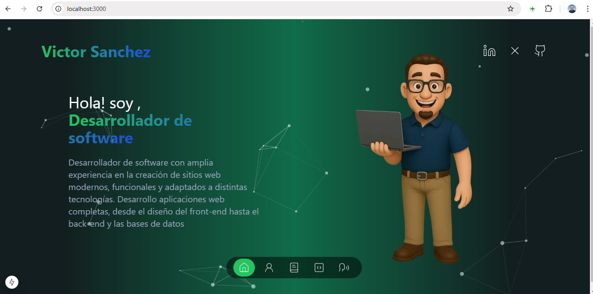

# Portafolio Profesional de Victor



[Ver el portafolio en línea](https://victorsanchez.vercel.app/)

## Descripción breve

Portafolio profesional desarrollado para mostrar proyectos, habilidades y experiencia como desarrollador de software. Incluye una presentación personal, sección de proyectos, habilidades, línea de tiempo y formulario de contacto.

## Estructura del proyecto
```
├── app/
│   ├── favicon.ico
│   ├── globals.css
│   ├── layout.tsx
│   ├── page.tsx
│   └── (routes)/
│       ├── about-me/
│       │   └── page.tsx
│       ├── contact/
│       │   └── page.tsx
│       ├── portfolio/
│       │   └── page.tsx
│       └── skills/
│           └── page.tsx
├── components/
│   ├── botones.tsx
│   ├── ContactCard.tsx
│   ├── container-page.tsx
│   ├── container.tsx
│   ├── cover-particles.tsx
│   ├── header.tsx
│   ├── introduction.tsx
│   ├── navbar.tsx
│   ├── portfolio-box.tsx
│   ├── TechnologiesSection.tsx
│   ├── time-line.tsx
│   └── transition-component.tsx
│   └── transition-page.tsx
├── lib/
│   └── utils.ts
├── public/
│   ├── agencia.png
│   ├── avatarVictor.jpg
│   ├── avatarVictor.png
│   ├── guitar.jpg
│   ├── proyecto1.png
│   ├── proyectoDesarrollo.png
│   └── Victor.png
├── utils/
│   └── motion-transitions.tsx
├── README.md
├── package.json
├── tailwind.config.ts
├── tsconfig.json
...otros archivos de configuración
```

## Tecnologías utilizadas
- Next.js
- React
- TypeScript
- Tailwind CSS
- react-type-animation

## Clonar y ejecutar localmente
```bash
git clone https://github.com/tuusuario/tu-repo-portafolio.git
cd tu-repo-portafolio
npm install
npm run dev
```
Abre [http://localhost:3000](http://localhost:3000) en tu navegador para ver el resultado.

## Sugerencias para modificar el portafolio
- Personaliza la información en los componentes de `introduction.tsx`, `about-me/page.tsx` y `skills/page.tsx`.
- Agrega o edita proyectos en la sección de portfolio modificando el componente `portfolio-box.tsx` o la fuente de datos correspondiente.
- Cambia los estilos en `globals.css` o ajusta la configuración de Tailwind en `tailwind.config.ts`.
- Puedes agregar nuevas rutas o secciones creando archivos en la carpeta `app/`.

---
¡Siéntete libre de personalizar este portafolio para que se adapte a tu perfil profesional!
